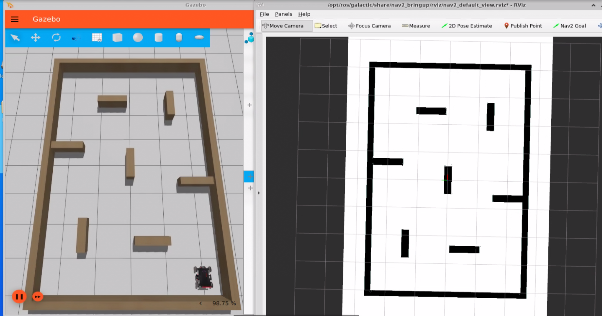
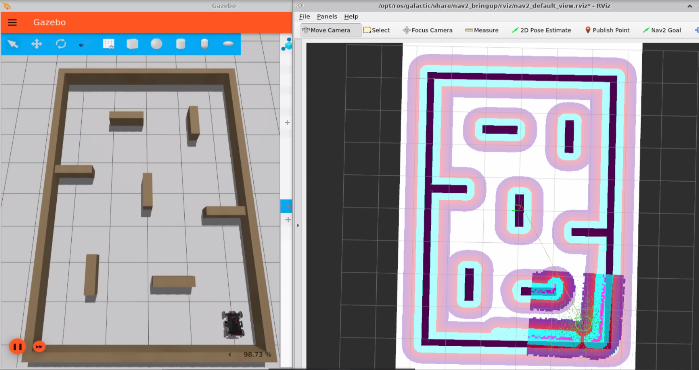
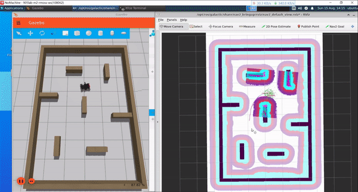

# rm_navigation2_demo

使用RoboMaster机器人运行Naviagtion2简单导航demo

**环境配置**

* ROS2版本要求: `Galactic` 
* Ignition仿真器版本要求: `Edifice`

```bash
# 安装依赖： ros-ign 和 navigation2
sudo apt-get install ros-galactic-ros-ign
sudo apt-get install ros-galactic-navigation2 ros-galactic-nav2-bringup 
# 依赖rmoss项目
git clone https://github.com/robomaster-oss/rmoss_interfaces
git clone https://github.com/robomaster-oss/rmoss_ign
git clone https://github.com/robomaster-oss/rmoss_ign_resources
git clone https://github.com/robomaster-oss/rmua19_ignition_simulator
```

**运行启动命令**

```bash
# 运行Ignition Gazebo仿真器
ros2 launch rm_navigation2_demos standard_robot_ign.launch.py 
# 运行Navigation2
ros2 launch rm_navigation2_demos navigation2.launch.py
```

运行这两个命令后，就能看到如下两个界面



**进行AMCL位置估计**

* 先点击`2D Pose Estimate`，然后在地图右下角点出位置（画出一个箭头），就会看到如下界面



**开始导航任务**

* 点击`Nav2 Goal`，然后在地图点出目标（画出一个箭头）

以下为导航示例gif动图



